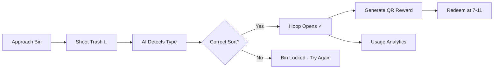

# JuanaBin PH

[](LICENSE)
[](https://aws.amazon.com)
[](https://aws.amazon.com/developer/community/community-builders/)

**AI-Powered Smart Waste Management & Circular Economy Platform**  
*Transforming Waste Into Wealth — From the Philippines to the World*

**BusloPH - Basket of Hope. Sort Right. Shoot Like a Champion.** 🏀

JuanaBin (powered by **BusloPH**) is an AI-powered, gamified smart waste segregation bin that turns disposal into a basketball game. Users "shoot" their trash, AI sensors detect if it's correct, the hoop opens when you sort right, and you earn QR rewards redeemable like cash. Building habits through fun, not fines.

**🏆 Awarded Best in Innovation** by Pasig City (2023) | **☁️ AWS Capstone 2026**

## Demo Results & Achievements

### AWS Capstone 2026 Metrics (As of August 21, 2026)

| Metric | Value | Description |
|--------|-------|-------------|
| **Demo Users** | 5 | Registered participants across 10 households |
| **Points Earned** | 1,009 | Total reward points (₱100.90 PHP value) |
| **Waste Collected** | 161 units/kg | Across 4 waste categories |
| **CO₂ Saved** | 10.75 kg | Carbon footprint offset |
| **Blockchain Txns** | 50+ | Verified on Stellar Testnet |
| **AWS Cost** | $20/month | Running on AWS Free Tier |

### Waste Collection Breakdown

- **Clear PET Bottles**: 40 pcs (24.8%) — 5 pts each
- **Colored PET Bottles**: 20 pcs (12.4%) — 3 pts each  
- **Plastic Sachets**: 100 pcs (62.1%) — 4 pts each
- **Food Waste**: 1 kg (0.6%) — 10 pts/kg

## The Problem

Despite signage, campaigns, and laws like RA 9003, most Filipinos still throw trash into the wrong bin. **Fines and instructions haven't fixed the problem** - because habits aren't built through rules. They're built through repetition, feedback, and reward.

- Contaminated recyclables raise sorting and hauling costs for LGUs
- Plastics like PET bottles and sachets end up in rivers instead of being recovered  
- Every LGU is legally required to implement source segregation under RA 9003 - most still struggle to enforce it

## The Solution: Gamified Basketball-Hoop Smart Bin

BusloPH turns waste disposal into a game. Users "shoot" trash into the bin, and AI sensors identify the material in real-time - sorting it into biodegradable, non-biodegradable, and food waste, with focused detection on high-value recyclables: **PET bottles, plastics, and sachets**.

### How It Works:

- **Sort right** → the hoop opens, the shot scores, and you earn a QR code reward redeemable like cash at partner convenience stores (7-11)
- **Sort wrong** → the bin won't open. No penalty, just a nudge to try again.

**Repeated, rewarded, correct action - every day - is what makes segregation automatic.** Over time, the reward becomes optional. The habit is the real product.

## Who Are Our Customers?

JuanaBin smart bins are designed for public spaces and institutions:

1. **LGU's** - City halls, Barangay halls, government offices
2. **Schools** - Public and private educational institutions
3. **Public Places** - Plazas, parks, recreational areas
4. **Public Markets** - Municipal and city markets
5. **Malls** - Shopping centers and commercial areas
6. **Hospitals** - Healthcare facilities
7. **Condo Units** - Residential communities
8. **Government Offices** - Various government facilities
9. **Business Establishments** - PEZA zones, commercial buildings
10. **Hotels** - Hospitality and tourism facilities

## Solution Overview

JuanaBin provides intelligent waste bins with three integrated technologies:

1. **Camera IoT / AI Vision** - Real-time waste detection with TensorFlow Lite on Raspberry Pi (98% accuracy)
2. **Smart Lock/Unlock System** - Basketball-hoop lid only opens for correct waste type
3. **Voice Guidance Speaker** - Audio prompts guide users to segregate correctly

The smart bins are solar-ready, IoT-enabled, gamified with basketball-hoop mechanics, and designed specifically for Philippine communities with features that reduce contamination and promote proper recycling. Powered by AWS infrastructure with Amazon Q AI agents (Researcher, Technical Writer, Data Analyst, Sales).

## Smart Bin Categories

Each JuanaBin installation includes three color-coded basketball-hoop bins:

### 🟢 Green Hoop: Food Waste (Biodegradable)
- Food scraps
- Fruit & vegetable peels
- Leftover cooked food
- Biodegradable waste

### 🟡 Yellow Hoop: Plastic Foil Wrapper (Plastik na Pambalot)
- Chip & snack wrappers
- Foil packaging
- Plastic-lined wrappers
- Candy/Food wrappers

### 🔵 Blue Hoop: PET Plastic (Bote na Plastik)
- PET water bottles
- Soft drink bottles
- Plastic drink containers
- Recyclable plastic bottles

## The Gamified Experience

### Basketball Hoop Design
The bin is designed like a basketball hoop - users "shoot" their trash in a fun, engaging way that makes disposal memorable and rewarding.

### AI Detection in Real-Time
AI sensors detect waste type the moment you "shoot." If correct, the hoop opens and you score. If wrong, no penalty - just try the right bin.

### QR Rewards Like Cash
Earn QR code rewards instantly, redeemable at convenience stores like 7-11. Real value for proper disposal creates positive reinforcement.

### Habit Formation Model
**Repetition + Feedback + Reward = Automatic Behavior**

Over time, the reward becomes optional. The habit is the real product.

## Architecture Overview

The system uses AI-powered gamification for behavior change:

- User approaches bin with waste
- User "shoots" trash like basketball
- AI sensors detect waste type in real-time
- Bin locks/unlocks based on correct sorting
- QR reward generated instantly
- User earns cash-equivalent value
- Data syncs to cloud for analytics



## Key Features

### Smart Bin Features (12 Core Features)

1. **Basketball Hoop Design** 🏀 - Gamified "shoot your trash" mechanic makes disposal fun
2. **AI Waste Detection** - Computer vision identifies waste type in real-time (TensorFlow Lite)
3. **Smart Lock/Unlock** - Lid only opens for correct waste (sort right = hoop opens, sort wrong = stays closed)
4. **Voice Guidance** - Audio prompts guide proper segregation
5. **QR Code Rewards** - Instant rewards redeemable like cash at 7-11, GCash, Maya
6. **Automatic Servo Lid** - Touch-free operation with IoT sensors
7. **Compaction System** - Built-in waste compaction reduces volume
8. **Odor Control** - Advanced system keeps bins fresh
9. **Solar/Battery Power** - Multiple power options for any location (solar-ready)
10. **LED Indicators** - Visual feedback for bin status
11. **Self-Sealing Bags** - Hygienic waste containment
12. **Edge AI** - TensorFlow Lite on Raspberry Pi for local inference

### Platform Features

- **Gamification** - Basketball-hoop mechanic builds habits through fun, not fines
- Real-time waste disposal tracking with blockchain verification (Stellar Testnet)
- Reward points system redeemable at partner stores (7-11, local shops)
- Environmental impact dashboard (carbon footprint, waste diverted)
- Community leaderboards and achievements
- Mobile app for iOS and Android (React Native / Flutter)
- Admin dashboard for facility managers (React.js + Tailwind)
- Multi-language support (English/Filipino)
- RA 9003 compliance reporting for LGUs

## Technology Stack

### Frontend & Mobile
- **Framework**: React Native / Flutter
- **Language**: TypeScript / Dart
- **Web**: React.js + Vite
- **Styling**: Tailwind CSS
- **Animation**: Framer Motion
- **State Management**: Redux Toolkit
- **Routing**: React Router
- **Notifications**: Firebase Cloud Messaging
- **QR Codes**: react-native-qrcode
- **Icons**: Lucide React

### Backend & Cloud (AWS Infrastructure)
- **Runtime**: FastAPI (Python)
- **Database**: AWS DynamoDB + Redis Cache
- **Storage**: AWS S3 (public bucket for images, reports, models)
- **CDN**: CloudFront
- **API**: AWS API Gateway (REST + WebSockets)
- **Compute**: AWS EC2 / ECS + Lambda Functions
- **Message Queue**: AWS SQS
- **CI/CD**: GitHub Actions
- **Monitoring**: AWS CloudWatch + Sentry
- **IoT**: MQTT / AWS IoT Core
- **Auth**: Firebase Auth / Phone OTP

### AI / ML
- **Training**: AWS SageMaker
- **Edge Inference**: TensorFlow Lite on Raspberry Pi
- **AI Agents**: Amazon Q (4 agents: Researcher, Technical Writer, Data Analyst, Sales)
- **Computer Vision**: Real-time waste detection model

### Hardware (Smart Bin)
- **Controller**: Raspberry Pi + Arduino
- **Camera**: IoT camera sensors for waste detection
- **Actuators**: Servo-controlled automatic lid
- **Sensors**: Weight sensors, fill-level sensors
- **Indicators**: LED status indicators
- **Audio**: Voice guidance speaker
- **Power**: Solar panels + battery backup
- **Connectivity**: WiFi/4G for cloud sync

### Blockchain
- **Network**: Stellar Testnet (50+ verified transactions)
- **Purpose**: Immutable waste records, transparent reward verification

### Data Pipeline
Excel → Python ETL → AWS DynamoDB → AWS S3 (public) → GitHub → React/Flutter Frontend

## 📌 Technical Implementation Highlights

### Excel → AWS Pipeline

This shows how the Excel demo data was connected to AWS services and made publicly accessible for frontend developers:

```
Excel File (Demo Data)
         ↓
Python ETL Script
         ↓
AWS DynamoDB (NoSQL Database)
         ↓
AWS S3 (Public Bucket)
         ↓
GitHub Repository (Public)
         ↓
Frontend Integration (React/Flutter)
```

**Data Flow Summary:**
1. **Excel File**: Contains demo data (5 users, 161 kg waste, 1,009 points, 10.75 kg CO₂ saved)
2. **Python ETL Script**: Extracts, transforms, and loads data from Excel to AWS
3. **AWS DynamoDB**: NoSQL database stores user profiles, transactions, reward schedules
4. **AWS S3**: Public bucket hosts static assets, reports, and exportable data
5. **GitHub Repository**: Version control and public code sharing
6. **Frontend Integration**: React.js/Flutter apps consume the AWS-hosted data

**AWS Services Used:**
- **DynamoDB**: User data, transactions, points, carbon footprint tracking
- **S3 + CloudFront**: Static assets, public data access, CDN distribution
- **Lambda**: Serverless functions for data processing
- **API Gateway**: RESTful API endpoints for frontend

**Result**: Real-time waste tracking system with transparent data accessible via web and mobile apps!

## Live Smart Bin Activity

The platform provides real-time transparency through a public activity feed that displays:
- Recent waste disposals with timestamps
- Bin IDs for location tracking
- Waste types and weights collected
- Reward points earned
- Proper segregation accuracy rates

### Sample Smart Bin Transaction

```javascript
{
  time: "21:42",
  binId: "BIN-014",
  type: "PET Plastic",
  weight: "850 g",
  points: 85,
  validated: true
}
```

## Reward Calculator

Users can estimate their potential rewards using the interactive calculator:
- Select waste type (organic, plastic, paper, metal)
- Enter estimated weekly/monthly weight
- View projected reward points (100 points = 1kg recyclable)
- See environmental impact contribution
- Understand redemption options at partner stores

## Mobile App Integration

The JuanaBin mobile app allows users to:
- Track their disposal history
- View accumulated reward points
- Redeem points at partner stores (7-11, local shops)
- Monitor personal environmental impact
- Find nearby JuanaBin smart bins
- Get notifications for special rewards
- View community leaderboards

## Installation

### Prerequisites

- Node.js 20 or newer
- npm 10 or newer
- Modern web browser

### Bootstrap

```bash
git clone https://github.com/elmergb/juanabin-landing-page.git
cd juanabin-landing-page
npm install
```

## Local Development

Run the development server:

```bash
npm run dev
```

The application will be available at `http://localhost:5173`

Build for production:

```bash
npm run build
```

Preview production build:

```bash
npm run preview
```

## Running Tests

```bash
npm run lint
npm run build
```

## Repository Structure

This repository contains the public-facing landing page. The JuanaBin ecosystem consists of multiple repositories:

### Main Repositories

- **[juanabin-landing-page](https://github.com/elmergb/juanabin-landing-page)** (this repo) - Public website and information
- **[JuanaBin-PH](https://github.com/JuanaBin-PH/JuanaBin-PH)** - Main documentation and project specifications
- **[juanabin-backend](https://github.com/JuanaBin-PH/juanabin-backend)** - API services and IoT data management

### Landing Page Structure

```text
src/
  app/                Application composition and routing
  components/
    layout/           Navbar and Footer components
    ui/               Reusable UI components
  config/             Site configuration and links
  feature/pages/      Landing page and dashboard features
    components/       Feature-specific components (Hero, Features, Calculator)
  hooks/              Custom React hooks
  assets/             Static assets and images
  main.tsx            Application entry point
public/               Public static files (logos, icons)
```

## Configuration

Site configuration is centralized in `src/config/site.js`:

```javascript
export const siteConfig = {
  name: 'JuanaBin',
  tagline: 'Segregate. Earn. Build a cleaner community.',
  links: {
    website: 'https://juliesoriano2026.wixsite.com/juanabin-ph',
    github: 'https://github.com/JuanaBin-PH/JuanaBin-PH',
    facebook: 'https://www.facebook.com/JuanaShootThatKalat',
    contact: 'mailto:juanabinph@gmail.com',
  },
}
```

## Documentation Links

- [Official Website](https://juliesoriano2026.wixsite.com/juanabin-ph)
- [GitHub Documentation](https://github.com/JuanaBin-PH/JuanaBin-PH) - Main documentation and project overview
- [Backend Repository](https://github.com/JuanaBin-PH/juanabin-backend) - API and IoT data services
- [Facebook Community](https://www.facebook.com/JuanaShootThatKalat)

## Community Engagement

JuanaBin is committed to building a cleaner Philippines through smart technology:

- **Public Space Partnerships**: Installing smart bins in high-traffic areas
- **Environmental Education**: Teaching proper waste segregation through interactive technology
- **Community Rewards**: Providing tangible benefits for proper disposal
- **Data Transparency**: Public tracking of waste collection and environmental impact
- **Local Partnerships**: Working with stores like 7-11 for reward redemption

## Security

We take security seriously. For security concerns or vulnerability reports regarding our IoT systems or data privacy, please contact us at juanabinph@gmail.com. Do not open public issues for security-sensitive findings.

## Contributing

Contributions are welcome! We encourage developers, environmental advocates, and community members to help improve the platform.

### How to Contribute

1. Fork the repository
2. Create a feature branch
3. Make your changes
4. Test thoroughly
5. Submit a pull request

## Business Model — 8 Revenue Streams

| # | Revenue Stream | Description | Year 1-3 Projection |
|---|---------------|-------------|---------------------|
| 1 | **Hardware Sales** | Smart bins at ₱50,000/unit to LGUs, schools, malls, hospitals | ₱2.5M → ₱25M+ |
| 2 | **SaaS Subscriptions** | Admin dashboard, RA 9003 compliance reporting (₱5K-₱15K/month) | ₱0.6M → ₱9M |
| 3 | **PET → Clothing** | Sustainable fashion from recycled bottles (₱500-₱1,500/item) | ₱1M → ₱15M |
| 4 | **Sachets → Furniture** | Premium eco-furniture from wrappers (₱2,000-₱10,000/piece) | ₱0.5M → ₱25M |
| 5 | **Food Waste → Fertilizer** | Organic compost for farmers (₱50-₱200/kg) | ₱0.15M → ₱8M |
| 6 | **Waste Hauling Services** | Collection & transportation (₱500-₱1,000/collection, 2-3x/week) | ₱3.9M → ₱39M+ |
| 7 | **Data Licensing** | Waste analytics & compliance reports (₱50K-₱500K/report) | ₱0.25M → ₱10M |
| 8 | **International Exports** | Hardware export, tech licensing, franchise (15+ countries) | ₱0.5M → ₱30M |

**3-Year Financial Projections:**
- **Year 1**: ₱9M–₱24M (Conservative → Optimistic)
- **Year 2**: ₱38M–₱71M  
- **Year 3**: ₱95M–₱161M

## Roadmap

### Phase 1 — Philippines Market (2026)
**Target: 50 Units | ₱9M–₱24M Revenue**
- ✅ AWS Capstone 2026 completed with demo data
- ✅ Working prototype validated & operational
- ✅ Best in Innovation Award — Pasig City (2023)
- Deploy 50 units across Metro Manila (Pasig, Quezon City, Makati)
- Establish Pasig City as flagship LGU partner
- Onboard 500+ users
- Launch PET clothing & sachet furniture manufacturing
- Expand to Samal Island (Davao) & Puerto Princesa pilot

### Phase 2 — Southeast Asia (2027)
**Target: 200+ Units | ₱38M–₱71M Revenue**
- Expand to Vietnam, Thailand, Indonesia
- 200+ units deployed across 3 countries
- Regional manufacturing hubs
- Partner with Grab, Gojek, major retailers
- App localization in 5+ languages
- Launch data licensing for ASEAN governments

### Phase 3 — South & East Asia (2028)
**Target: 500+ Units | ₱95M–₱161M Revenue**
- Expand to India, Bangladesh, Malaysia
- 500+ units across 8+ countries
- Technology licensing to local partners
- Franchise model deployment
- Global circular economy supply chains
- Carbon credit marketplace integration

### Phase 4 — Global Leadership (2029-2030)
**Target: 1M+ Users | $10M+ USD Annual Revenue**
- Africa, Latin America, Middle East, Europe
- 15+ countries operational
- 1 million+ active users globally
- Public offering / strategic acquisition
- UN SDG partnerships (SDG 12, 13, 14, 15)
- 100M+ tons waste diverted from landfills

## Frequently Asked Questions

### How does the basketball hoop mechanic work?

You "shoot" your trash toward the bin like a basketball shot. AI sensors detect the waste type in real-time using TensorFlow Lite on Raspberry Pi. If you sort correctly, the hoop opens and you score points. If you sort wrong, the bin stays closed with no penalty - just a gentle nudge to try the right bin. It's gamified to make segregation fun!

### What rewards do I get and where can I use them?

You earn QR code rewards redeemable like cash at partner convenience stores such as 7-11, GCash, and Maya. Based on our AWS Capstone demo:
- **Clear PET bottles**: 5 points each
- **Colored PET bottles**: 3 points each
- **Plastic sachets**: 4 points each
- **Food waste**: 10 points per kg

The rewards provide instant positive reinforcement that builds automatic segregation habits over time.

### Why use gamification instead of fines and rules?

Because habits aren't built through rules - they're built through **repetition, feedback, and reward**. Fines and instructions haven't worked in the Philippines. Making segregation fun (basketball hoop!) and rewarding (QR codes at 7-11!) creates automatic behavior that lasts. Over time, the reward becomes optional. **The habit is the real product.**

### What waste types does BusloPH sort?

BusloPH sorts waste into three categories mirroring **RA 9003 compliance**:
- **Biodegradable (Green)**: Food scraps, organic waste
- **Non-Biodegradable (Yellow)**: Plastic sachets, foil wrappers
- **High-Value Recyclables (Blue)**: PET bottles, cans, glass

Focused detection on high-value recyclables (PET, sachets) that fund the circular economy.

### How does this solve the Philippines' waste problem?

**The Problem:**
- Contaminated recyclables raise sorting costs for LGUs
- Plastics end up in rivers instead of being recovered
- Every LGU must implement segregation under RA 9003 but most struggle
- Traditional enforcement (fines, rules) hasn't worked

**BusloPH's Solution:**
- Makes compliance **automatic through habit formation**, not enforcement
- Gamified experience encourages participation
- Blockchain verification provides transparent RA 9003 reporting for LGUs
- Circular economy transforms waste into wealth (PET → clothing, sachets → furniture)

### How does the circular economy work?

Collected waste is transformed into valuable products:
- **PET Bottles → Clothing**: Sustainable fashion (₱500-₱1,500/item)
- **Sachets → Furniture**: Eco-furniture from wrappers (₱2,000-₱10,000/piece)
- **Food Waste → Fertilizer**: Organic compost for farmers (₱50-₱200/kg)

This creates 8 revenue streams (hardware sales, SaaS, upcycled products, waste hauling, data licensing, exports) projecting ₱9M-₱24M in Year 1.

### What's the AWS connection?

**AWS Capstone 2026** powers JuanaBin's cloud infrastructure:
- **Compute**: AWS EC2/ECS + Lambda for serverless functions
- **Storage**: AWS S3 + CloudFront CDN
- **Database**: DynamoDB + Redis caching
- **AI/ML**: AWS SageMaker for training, TensorFlow Lite for edge inference
- **IoT**: AWS IoT Core for smart bin connectivity
- **Analytics**: CloudWatch + Amazon Q agents (4 AI agents: Researcher, Technical Writer, Data Analyst, Sales)
- **Cost**: Running on AWS Free Tier ($20/month)

Demo results: 5 users, 1,009 points earned, 161 kg waste collected, 10.75 kg CO₂ saved, 50+ blockchain transactions.

### Where are BusloPH bins located?

Smart bins are deployed in **10 customer categories**:
1. LGU's (City/Barangay halls)
2. Schools (Public & private)
3. Public Places (Plazas, parks)
4. Public Markets
5. Malls
6. Hospitals
7. Condo Units
8. Government Offices
9. Business Establishments (PEZA zones)
10. Hotels

**Current Pilot**: Metro Manila (Pasig, Quezon City, Makati), Samal Island (Davao), Puerto Princesa

### Is BusloPH production-ready?

Yes! BusloPH has:
- ✅ Completed **AWS Capstone 2026** with demo data
- ✅ Working prototype validated & operational
- ✅ **Best in Innovation Award** from Pasig City (2023)
- ✅ 50+ Stellar Testnet blockchain transactions verified
- ✅ Pilot deployments underway

**Roadmap:**
- **Year 1 (2026)**: 50 units, ₱9M-₱24M revenue, Philippines market
- **Year 2 (2027)**: 200+ units, ₱38M-₱71M, Southeast Asia expansion (Vietnam, Thailand, Indonesia)
- **Year 3 (2028)**: 500+ units, ₱95M-₱161M, South & East Asia (India, Bangladesh, Malaysia)
- **Year 4+ (2029-2030)**: 1M+ users, $10M+ USD, Global (15+ countries)

### What makes BusloPH different from other waste bins?

1. **Gamified** - Basketball hoop makes it fun, not a chore
2. **AI-Powered** - Real-time waste detection (TensorFlow Lite)
3. **Instant Rewards** - QR codes redeemable like cash at 7-11
4. **Circular Economy** - Waste becomes clothing, furniture, fertilizer
5. **Blockchain Verified** - Transparent RA 9003 compliance reporting (Stellar)
6. **AWS Cloud** - Scalable infrastructure with Amazon Q AI agents
7. **Habit Formation** - Repetition + Feedback + Reward = Automatic behavior
8. **Award-Winning** - Best in Innovation, Pasig City (2023)

## License

This project is licensed under the MIT License. See [LICENSE](LICENSE) for details.

## AWS Community Builders Impact

*"Even though I just tagged along for a while, I feel at home with the AWS Community Builders. The welcoming environment, diverse perspectives, and supportive network have transformed not just my technical skills, but my confidence as a speaker and leader."*

— **Julie Ann Soriano**, Founder & CEO, JuanaBin PH | AWS Community Builders, Philippines

### Personal Growth Journey
- **Before AWS Community Builders**: Quiet introvert, anxious about public speaking, limited network
- **With AWS Community Builders**: Confident speaker, sharing JuanaBin globally, local & international connections built

### What AWS Community Builders Provided
- ☁️ Technical AWS expertise & best practices
- 🎤 Confidence to speak publicly before diverse audiences
- 🌏 Inspiration to think globally (Philippines → Southeast Asia → World)
- ✅ Validation of JuanaBin PH vision
- 🤝 Lifelong professional friendships and sense of belonging

**Amazon Q Agents**: The feature I love most about AWS is the customized agents — Researcher, Technical Writer, Data Analyst, and Sales agents. These AI-powered agents saved hundreds of hours of work and helped transform JuanaBin PH from an idea into a fully documented, investor-ready platform.

## Contact

- **Founder**: Julie Ann Soriano (CEO)
- **Phone**: 09924505499
- **Email**: juanabinph@gmail.com
- **Facebook**: [@JuanaShootThatKalat](https://www.facebook.com/JuanaShootThatKalat)
- **Website**: [www.juanabin.ph](https://juliesoriano2026.wixsite.com/juanabin-ph)
- **GitHub**: [JuanaBin-PH](https://github.com/JuanaBin-PH)
- **Program**: AWS Capstone 2026 | AWS Community Builders

**Hashtags**: #WasteSegregationMadeEasy #AWSCommunityBuilders #CircularEconomy #BusloPH

## Acknowledgements

JuanaBin PH builds on the work of:
- **AWS Community Builders** — Philippines & Global network
- **AWS Capstone 2026** — Cloud infrastructure & Amazon Q agents
- **Pasig City Government** — Best in Innovation Award (2023)
- **Partner LGUs** — Samal Island, Puerto Princesa, and others
- **Environmental advocates** across the Philippines
- **IoT technology partners** and local manufacturers
- All **community members** who believe in transforming waste into wealth

Special thanks to the AWS Community Builders program for transforming a quiet introvert into a confident speaker and leader.

---

## Taglines

**BusloPH**: *Basket of Hope. Sort Right. Shoot Like a Champion.* 🏀  
**JuanaBin**: *Segregate. Earn. Build a cleaner community.* ♻️

**Vision**: Transforming Waste Into Wealth — From the Philippines to the World 🌍
