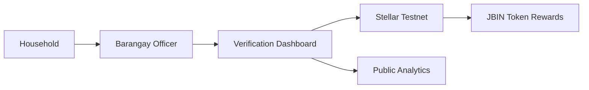

# JuanaBin PH

[](LICENSE)

JuanaBin is a blockchain-powered waste management platform for Philippine barangays. It combines Stellar blockchain technology, transparent reward systems, and a mobile-first experience to transform household waste segregation into instant, verifiable micro-rewards while promoting environmental sustainability and financial inclusion.

## Why JuanaBin Exists

Traditional waste management in Philippine barangays lacks transparency, proper incentives, and reliable tracking. JuanaBin exists to bridge the gap between community-driven environmental action and blockchain-powered reward systems by providing a transparent, auditable, and inclusive framework for waste collection, verification, and token-based compensation.

## Problem Statement

Many waste management initiatives struggle with:
- Lack of transparency in collection and reward distribution
- Limited incentives for household participation
- No reliable tracking of environmental impact
- Exclusion of unbanked households from digital reward systems
- Difficulty verifying waste segregation compliance

JuanaBin addresses these challenges with a system that:

- Supports transparent waste collection tracking on Stellar blockchain
- Enables instant JBIN token rewards for verified waste segregation
- Provides QR-based verification for barangay officers
- Keeps all transactions verifiable on-chain through Stellar testnet
- Offers mobile-first experience accessible to all community members

## Solution Overview

JuanaBin combines three layers:

1. **Stellar blockchain** for transparent transaction recording and token distribution
2. **Web application** for public information, analytics, and dashboard access
3. **Mobile-ready interface** for household waste tracking and reward claims

The platform is designed to be accessible and scalable so that barangays across the Philippines can adopt the system without complex technical requirements.

## Architecture Overview

The system is organized around a simple trust model:

- Households segregate waste and receive collection verification from barangay officers
- Officers record waste collection events with weight and type
- System calculates JBIN token rewards based on verified waste
- Transactions are recorded on Stellar testnet for transparency
- Community members can track environmental impact in real-time



## Key Features

- Transparent waste collection tracking on Stellar blockchain
- Real-time JBIN token reward distribution
- QR-based verification system for barangay officers
- Public live activity feed showing verified transactions
- Waste segregation calculator for reward estimation
- Environmental impact tracking (CO2 avoided, waste diverted)
- Mobile-responsive design for all community members
- Multi-language support (English/Filipino)

## Technology Stack

- **Frontend**: React + Vite for fast, modern web experience
- **Styling**: Tailwind CSS for responsive design
- **Animation**: Framer Motion for smooth interactions
- **Routing**: React Router for navigation
- **Blockchain**: Stellar testnet for transaction verification
- **Icons**: Lucide React for consistent UI elements

## Live Activity Feed

The platform provides real-time transparency through a public activity feed that displays:
- Recent waste collection events with timestamps
- Barangay officer IDs for accountability
- Waste types and weights collected
- JBIN rewards distributed
- Links to Stellar Explorer for transaction verification

### Sample Transaction Data

```javascript
{
  time: "21:42",
  officer: "BRGY-014",
  type: "PET Plastic",
  weight: "850 g",
  jbin: 0.85
}
```

## Reward Calculator

Households can estimate their potential earnings using the interactive calculator:
- Input waste type (organic, plastic, paper, metal)
- Enter estimated weekly/monthly weight
- View projected JBIN token rewards
- Understand environmental impact contribution

## Wallet Integration

JuanaBin supports multiple Stellar-compatible wallets for secure token management:
- Albedo
- xBull  
- Freighter
- LOBSTR
- And other Stellar Wallets Kit supported wallets

The connection flow provides a secure, user-friendly experience powered by Stellar's wallet infrastructure.

## Installation

### Prerequisites

- Node.js 20 or newer
- npm 10 or newer
- Modern web browser

### Bootstrap

```bash
git clone https://github.com/elmergb/juanabin-landing-page.git
cd juanabin-landing-page
npm install
```

## Local Development

Run the development server:

```bash
npm run dev
```

The application will be available at `http://localhost:5173`

Build for production:

```bash
npm run build
```

Preview production build:

```bash
npm run preview
```

## Running Tests

```bash
npm run lint
npm run build
```

## Repository Structure

This repository contains the public-facing landing page. The JuanaBin ecosystem consists of multiple repositories:

### Main Repositories

- **[juanabin-landing-page](https://github.com/elmergb/juanabin-landing-page)** (this repo) - Public website and information
- **[JuanaBin-PH](https://github.com/JuanaBin-PH/JuanaBin-PH)** - Main documentation and project specifications
- **[juanabin-backend](https://github.com/JuanaBin-PH/juanabin-backend)** - API services and backend infrastructure

### Landing Page Structure

```text
src/
  app/                Application composition and routing
  components/
    layout/           Navbar and Footer components
    ui/               Reusable UI components
  config/             Site configuration and links
  feature/pages/      Landing page and dashboard features
    components/       Feature-specific components
  hooks/              Custom React hooks
  assets/             Static assets and images
  main.tsx            Application entry point
public/               Public static files
```

## Configuration

Site configuration is centralized in `src/config/site.js`:

```javascript
export const siteConfig = {
  name: 'JuanaBin',
  tagline: 'Segregate. Earn. Build a cleaner community.',
  links: {
    website: 'https://juliesoriano2026.wixsite.com/juanabin-ph',
    github: 'https://github.com/JuanaBin-PH/JuanaBin-PH',
    stellarExplorer: 'https://stellar.expert/explorer/testnet',
    facebook: 'https://www.facebook.com/JuanaShootThatKalat',
    contact: 'mailto:JuanaShootThatKalatjuanabinph@gmail.com',
  },
}
```

## Documentation Links

- [Official Website](https://juliesoriano2026.wixsite.com/juanabin-ph)
- [GitHub Documentation](https://github.com/JuanaBin-PH/JuanaBin-PH) - Main documentation and project overview
- [Backend Repository](https://github.com/JuanaBin-PH/juanabin-backend) - API and backend services
- [Stellar Testnet Explorer](https://stellar.expert/explorer/testnet)
- [Facebook Community](https://www.facebook.com/JuanaShootThatKalat)

## Community Engagement

JuanaBin is committed to building a cleaner Philippines through community participation:

- **Barangay Partnerships**: Working directly with local governments
- **Environmental Education**: Teaching proper waste segregation
- **Financial Inclusion**: Providing blockchain access to unbanked households
- **Transparency**: Public verification of all waste collection activities

## Security

We take security seriously. For security concerns or vulnerability reports, please contact us at JuanaShootThatKalatjuanabinph@gmail.com. Do not open public issues for security-sensitive findings.

## Contributing

Contributions are welcome! We encourage developers, environmental advocates, and community members to help improve the platform.

### How to Contribute

1. Fork the repository
2. Create a feature branch
3. Make your changes
4. Test thoroughly
5. Submit a pull request

## Roadmap

### Current Phase (Pilot)
- ✅ Landing page with live activity feed
- ✅ Waste calculator tool
- ✅ Stellar testnet integration
- ✅ Wallet connection interface
- ✅ Public dashboard

### Next Phase
- Mobile app for households
- Officer verification mobile tools
- Enhanced analytics dashboard
- Multi-barangay support
- Mainnet deployment

### Future Vision
- Nationwide adoption across Philippine barangays
- Partnerships with recycling facilities
- Expanded reward marketplace
- Carbon credit integration
- Regional environmental impact tracking

## Frequently Asked Questions

### Is JuanaBin production-ready?

JuanaBin is currently in pilot phase with testnet deployment. We are actively testing with partner barangays and refining the user experience before mainnet launch.

### How do households receive rewards?

Households receive JBIN tokens directly to their Stellar wallet after each verified waste collection event. Tokens can be tracked in real-time on the Stellar testnet.

### What types of waste are accepted?

Currently supported waste categories:
- PET Plastic
- Organic waste
- Paper
- Sachet packaging
- Metal

### Is a wallet required?

Yes, households need a Stellar-compatible wallet to receive JBIN token rewards. We provide easy wallet connection through supported providers like Albedo, Freighter, and xBull.

### Where should I start?

For households: Visit the landing page, explore the calculator, and learn about waste segregation benefits.
For barangays: Contact us to discuss pilot program participation.
For developers: Check the repository structure and contribution guidelines.

## License

This project is licensed under the MIT License. See [LICENSE](LICENSE) for details.

## Contact

- **Email**: JuanaShootThatKalatjuanabinph@gmail.com
- **Facebook**: [@JuanaShootThatKalat](https://www.facebook.com/JuanaShootThatKalat)
- **Website**: [JuanaBin PH](https://juliesoriano2026.wixsite.com/juanabin-ph)
- **GitHub**: [JuanaBin-PH](https://github.com/JuanaBin-PH)

## Acknowledgements

JuanaBin builds on the work of the Stellar ecosystem, React community, and environmental advocates across the Philippines. Special thanks to all partner barangays and community members who believe in a cleaner, more sustainable future.

---

**Tagline**: *Segregate. Earn. Build a cleaner community.*
